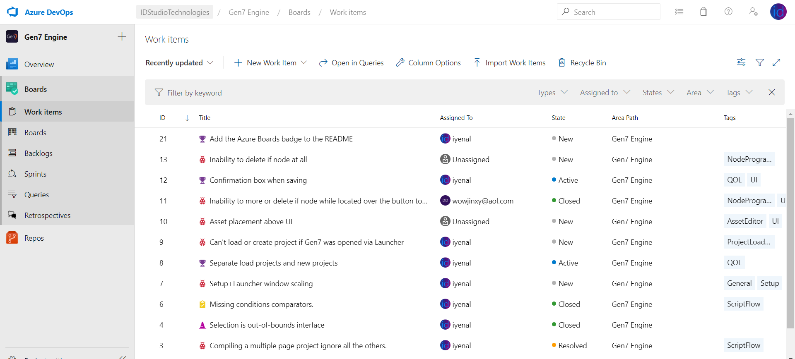
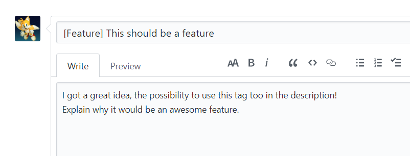
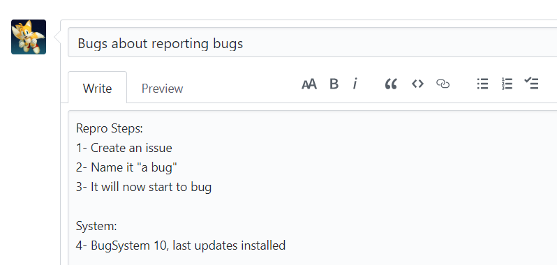

# Gen7 Engine Bug Reporting
This repository is dedicated for Gen7 Engine bug reports. I use Azure DevOps to keep track of issues (as Work Items) as it's more practical and easier to organize, so this GitHub repository is mirrored to the DevOps Boards (using Zapier).
Please read the following instructions to contribute.

## How to view submitted issues, bugs and features?

Head over there: https://dev.azure.com/IDStudioTechnologies/Gen7%20Engine/_workitems

*To view all the Work Items even the completed ones, enable "Show Completed Work Items" on the right top options menu.*

## How to submit issues, bugs and features?

Thanks to Zapier Automated Tasks, all the GitHub issues are submitted on the Azure DevOps one. However please follow this naming:

### Submit an issue

To submit an issue, please add [Issue] at first of your title, or in your description.

### Submit a feature idea

To submit a feature, please add [Feature] at first of your title, or in your description.

### Submit a bug

To submit a bug, no special text tag is needed. However please make attention that your bug is an actual bug (it should behave like that but it doesn't) and not an issue (I can't do that because it's missing), and add in description the Repro Steps.

## Statistics from DevOps
Features: 

User Reports (Stories):

